# 基于Qwen2的智能数据处理与分析平台-SleepingFaceBi

## 功能
***
+ [x] 登录注册功能
+ [X] 分布式用户验证
+ [X] 网关鉴权
+ [x] 消息队列异步化处理
+ [x] AIGC-智能文本处理
+ + [x] 文本格式转换(支持txt,doc,docx,markdown)
+ [x] AIGC-智能数据分析与可视化(支持xlsx,csv)
+ [x] AIGC-智能数据处理
+ + [x] 智能格式转换
+ + [x] 智能数据清洗
+ + [x] 智能数据筛选
+ + [x] 智能数据表格
+ [x] 积分功能
+ [x] SDK开发
+ [❌] SleepingFace小助手(waiting)
+ + [x] 大白话->公文(v1.0)

## 架构
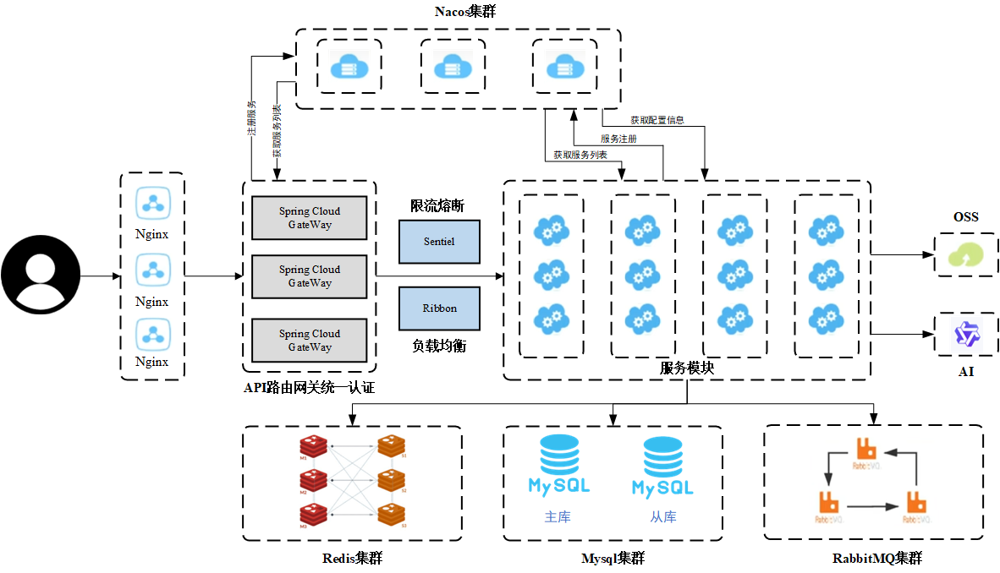
> tips:完整版正在donging...

## 服务模块设计
- 服务模块：sleepingFaceBi-user（用户服务），sleepingFaceBi-chart（图表服务），sleepingFaceBi-text（文本服务），sleepingFaceBi-data（数据服务）。
- 公共服务模块：sleepingFaceBi-common-ai(AI服务), sleepingFaceBi-common-configs(配置管理服务),sleepingFaceBi-common-commm(公共服务), sleepingFaceBi-common-mq(消息队列服务), sleepingFaceBi-common-mybatis
- 远程调用模块：sleeingFaceBi-api
- 网关模块：sleepingFaceBi-gateway(网关服务)

## SDK开发模块
- api-client-sdk
只需引入依赖，配置ak/sk，即可调用API。

## 技术栈

### 后端
***
- Spring Boot （万能后端模板）
- spring cloud
- MySQL
- Mybatis-Plus及Mybatis X自动生成
- Redis + redisson 限流
- RabbitMq
- Dubbo
- Nacos
- Sa-token
- Swagger
- Easy Excel
- JDK线程池及异步化
### 前端
***
- React 18
- Ant Design Pro 5.x 脚手架
- Umi 4前端框架
- Ant Design 组件库
- Echarts 可视化库

## TODO:
- 目前只使用了redis+redisson做限流，可以考虑使用redis来存储生成的文本数据等，提高加载速度。
- 完善登录方式，目前只支持用户名密码登录。(JustAuth)
- 任务执行的结果情况可以给用户发送实时消息通知。(Websocket)
- 考虑负载均衡，提高服务的可用性。
- API功能完善，增加更多的接口。
- 继续训练"SleepingFace小助手"大模型。
- code cleaning.

## 效果图
***
### 登录页
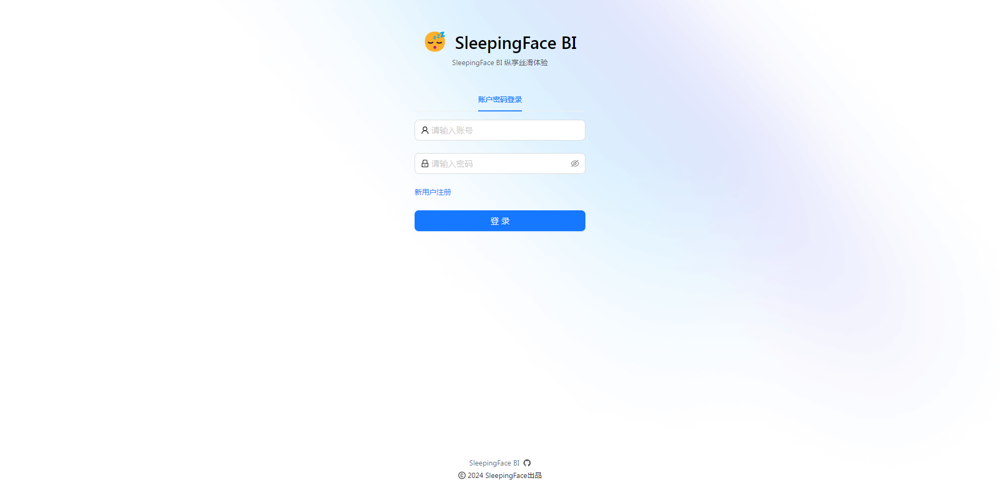
### 注册页
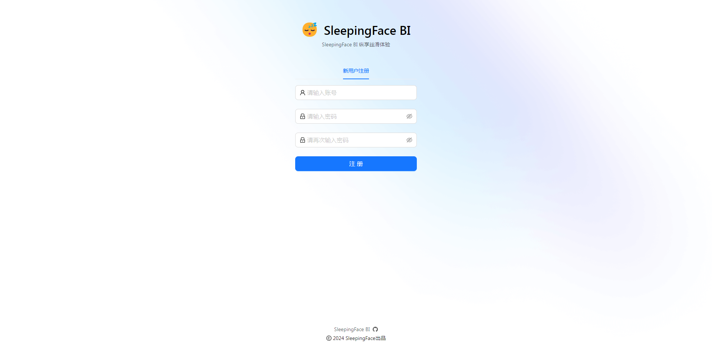
### 首页
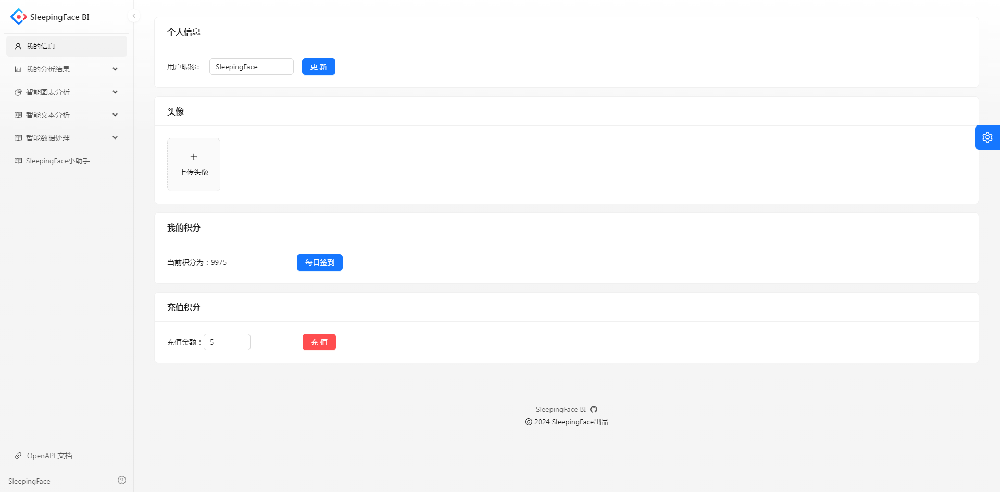
### 智能图表分析
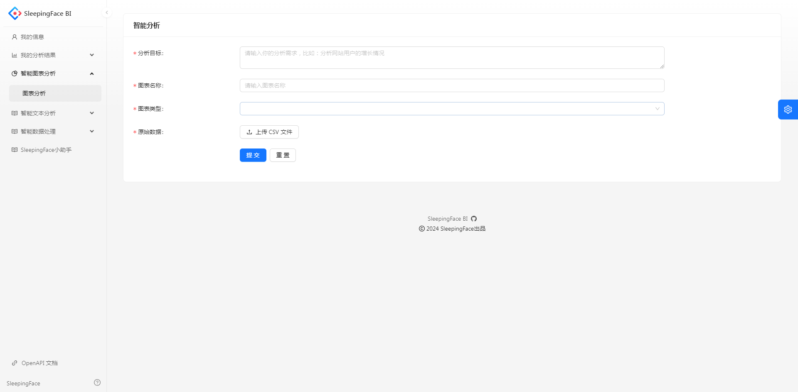
### 智能文本分析
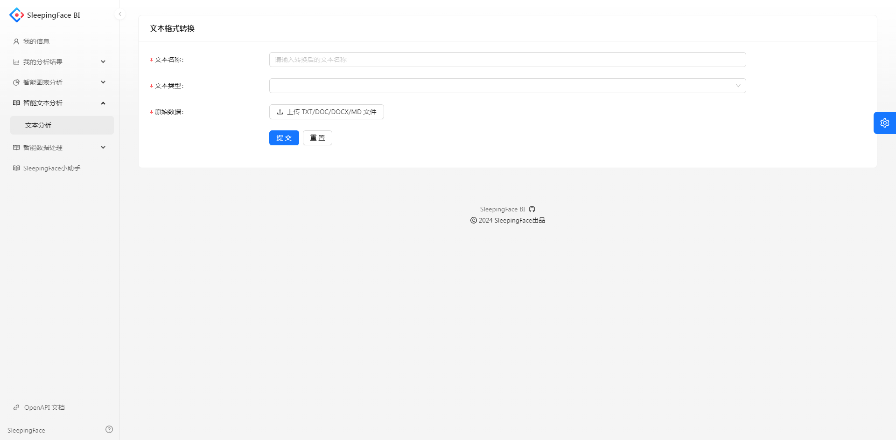
### 智能数据处理
#### 格式转换
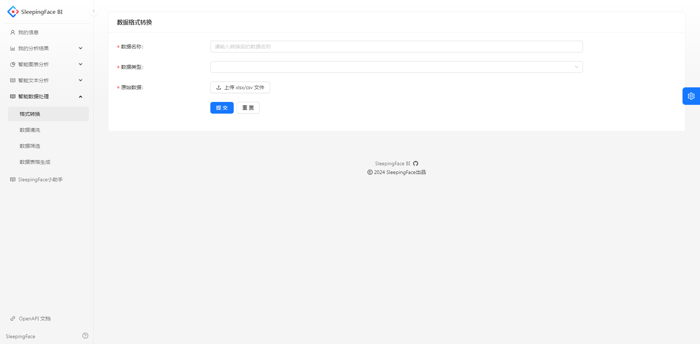
#### 数据清洗
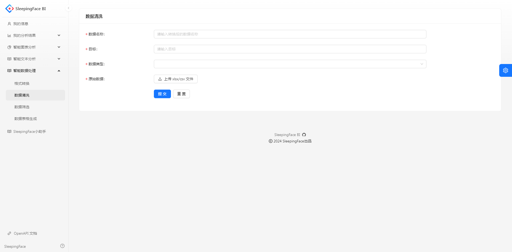
#### 数据筛选
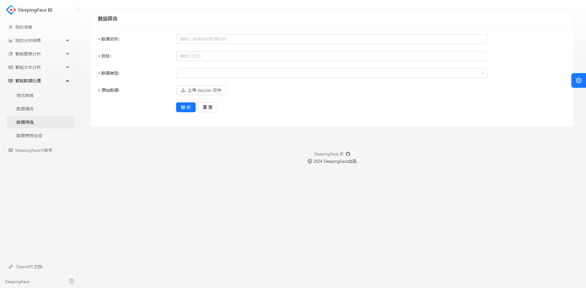
#### 数据表格
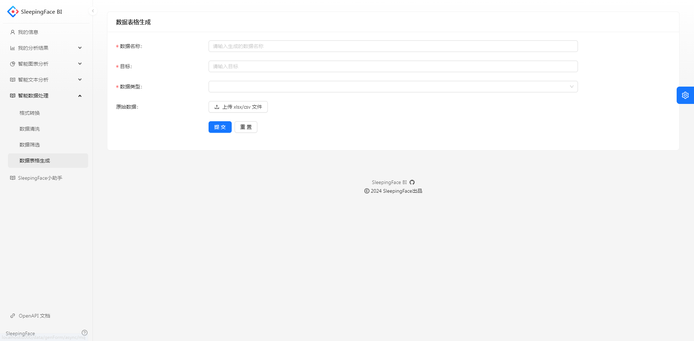
### 我的图表
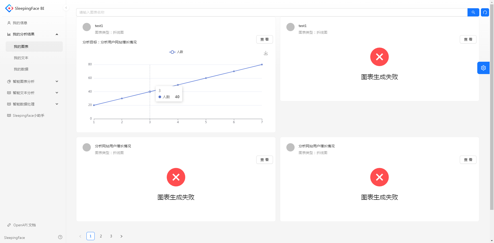
### 我的文本
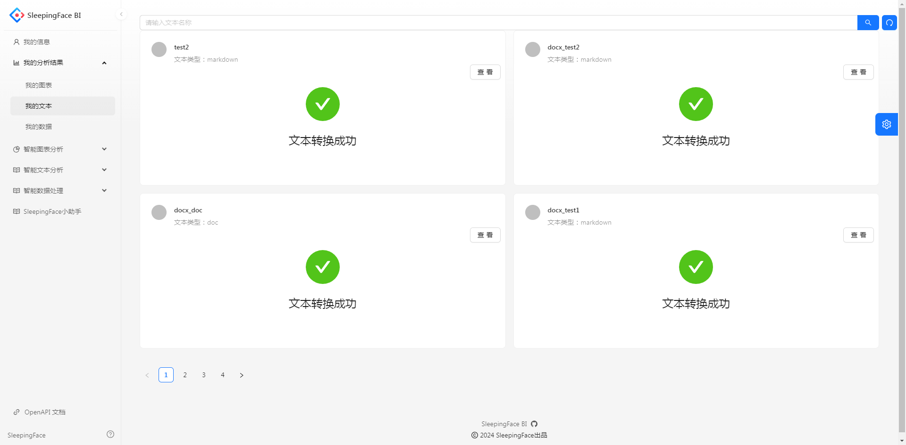
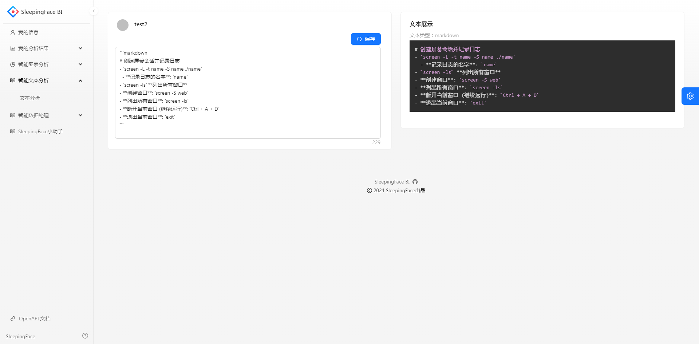
### 我的数据
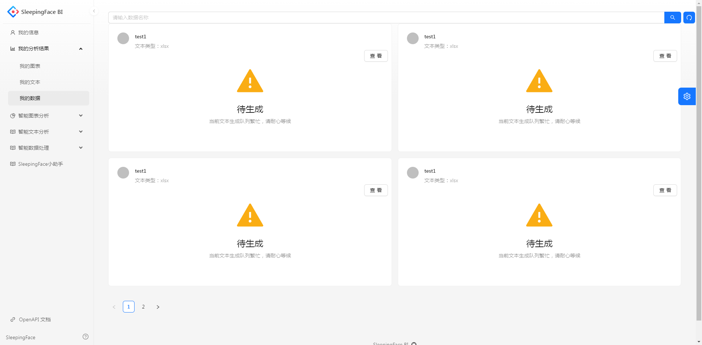
### SDK开发
1.引入Maven依赖;
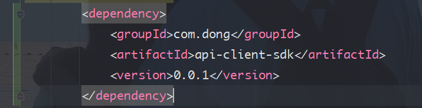
2.配置ak/sd;
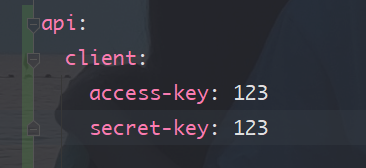
3.调用API;
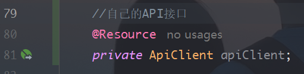
